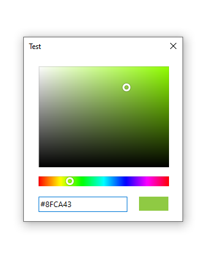

# SharpColorPicker
A beautiful C# Winform based modern color picker. The user control component comes up with the basic sliders that can be extended as per your needs as shown in the Test project.



```
Install-Package SharpColorPicker
```

# How to use
Picker color can be be get or set using the Color attribute

```
 private void sharpColorPicker1_ColorChanged(object sender, EventArgs e)
  {
      pictureBox1.BackColor = sharpColorPicker1.Color;
  }
```

# Requirments
* .NET Framework 3.0 or later;
* Windows Forms.

# License

This project is licensed under MIT License

Copyright © 2018, [TabishRafiq](https://github.com/TabishRafiq)
